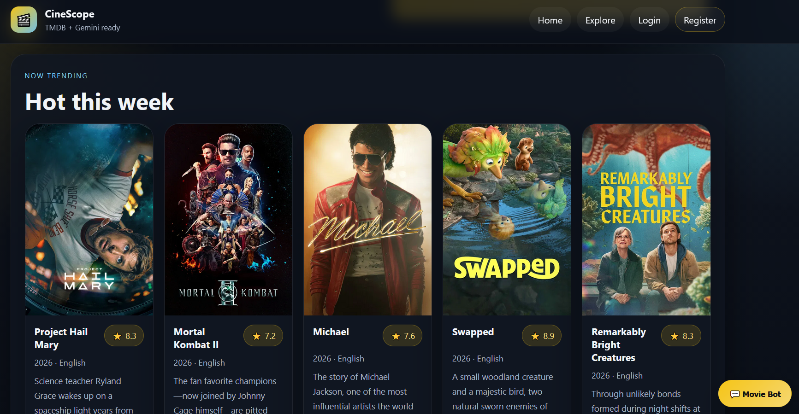

# CineScope: AI-Powered Movie Discovery Platform

CineScope is a modern movie discovery website built with Flask, TMDB API, Gemini AI, SQLite, HTML, CSS, and JavaScript.

It combines live movie search, personalized recommendations, optional user authentication, an admin dashboard, and a movie chatbot in a single platform.

## Features

- Live movie search using TMDB
- Trending, popular, and top-rated movie sections
- Movie detail pages with poster, rating, overview, cast, and related information
- Optional user registration and login
- Personalized recommendations based on saved preferences
- Gemini-powered movie chatbot
- Admin dashboard for user and login activity monitoring
- Local CSV fallback catalog when API access is unavailable
- Modern dark cinematic interface

## Chatbot Capabilities

The chatbot can answer movie-related questions such as:

- `Leonardo DiCaprio and Kate Winslet`
- `My Heart Will Go On`
- `Who directed Inception?`
- `Show me sci-fi movies`
- `Shah Rukh Khan`

It returns grounded movie results with clickable movie cards.

## Technologies Used

- Python
- Flask
- SQLite
- HTML
- CSS
- JavaScript
- TMDB API
- Gemini API

## Project Structure

```text
cinescope-ai-movie-platform/
│
├── app.py
├── requirements.txt
├── API_SETUP.txt
├── .env.example
├── README.md
├── .gitignore
│
├── data/
│   └── movies.csv
│
├── static/
│   └── style.css
│
└── templates/
    ├── base.html
    ├── index.html
    ├── results.html
    ├── movie_detail.html
    ├── login.html
    ├── register.html
    ├── preferences.html
    └── admin_dashboard.html

```

## Installation

Install the required packages:

```bash
pip install -r requirements.txt
```

Run the application:

```bash
python app.py
```

Open in browser:

```text
http://127.0.0.1:5000
```

## API Setup

Set environment variables before running the app.

### Windows Command Prompt

```bash
setx TMDB_BEARER_TOKEN "your_tmdb_token_here"
setx AI_PROVIDER "gemini"
setx GEMINI_API_KEY "your_gemini_api_key_here"
```

After setting them, close Command Prompt and open a new one.

## Admin Login

Default admin account:

```text
Username: admin
Password: admin123
```
## Screenshot of The Homepage


